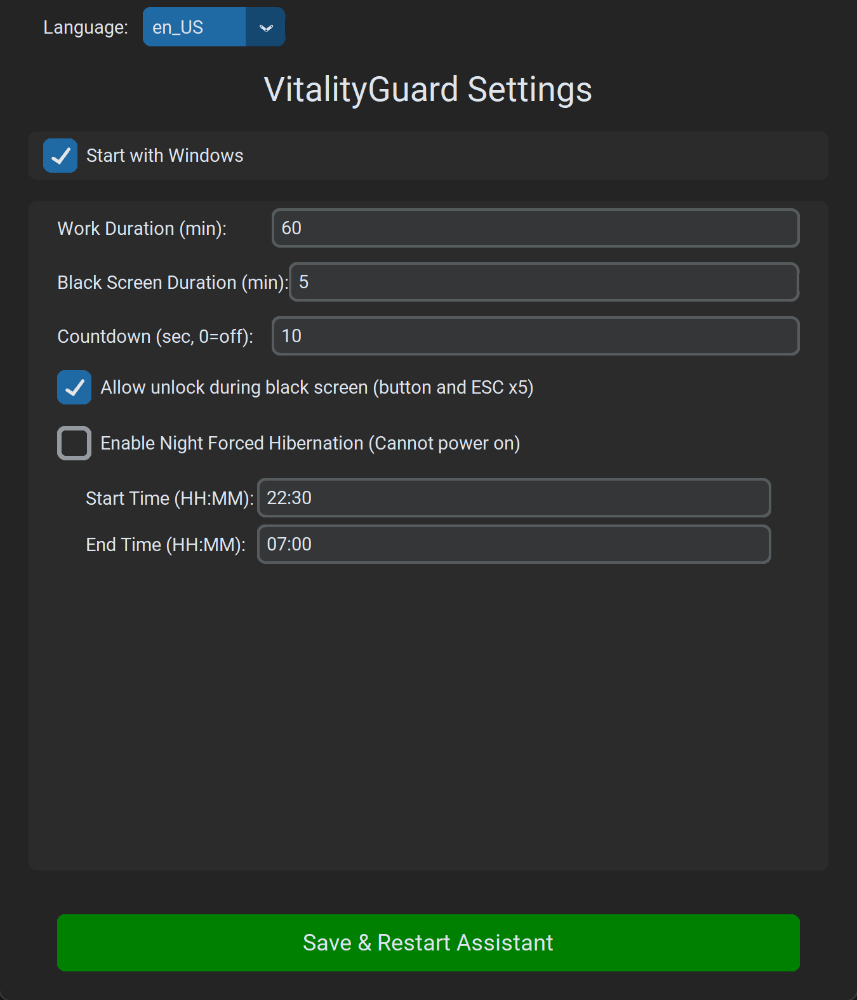
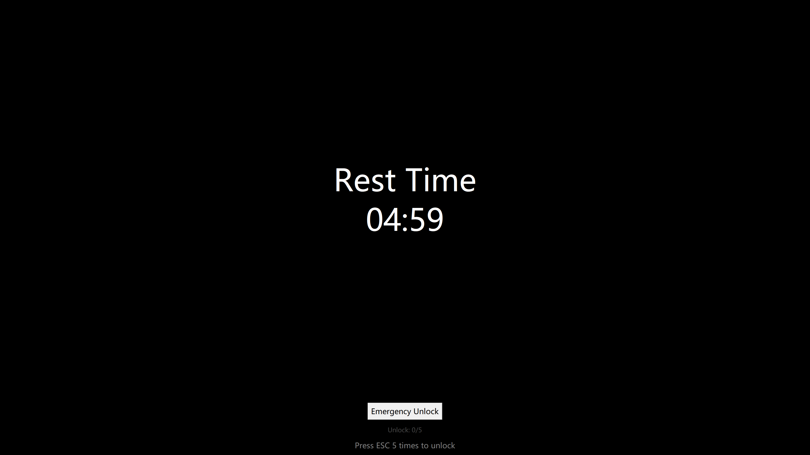
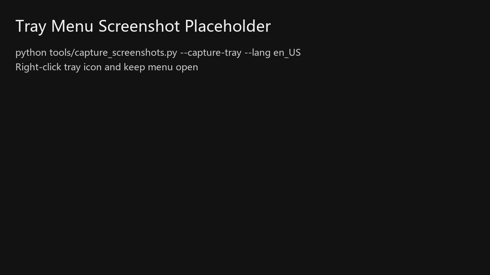
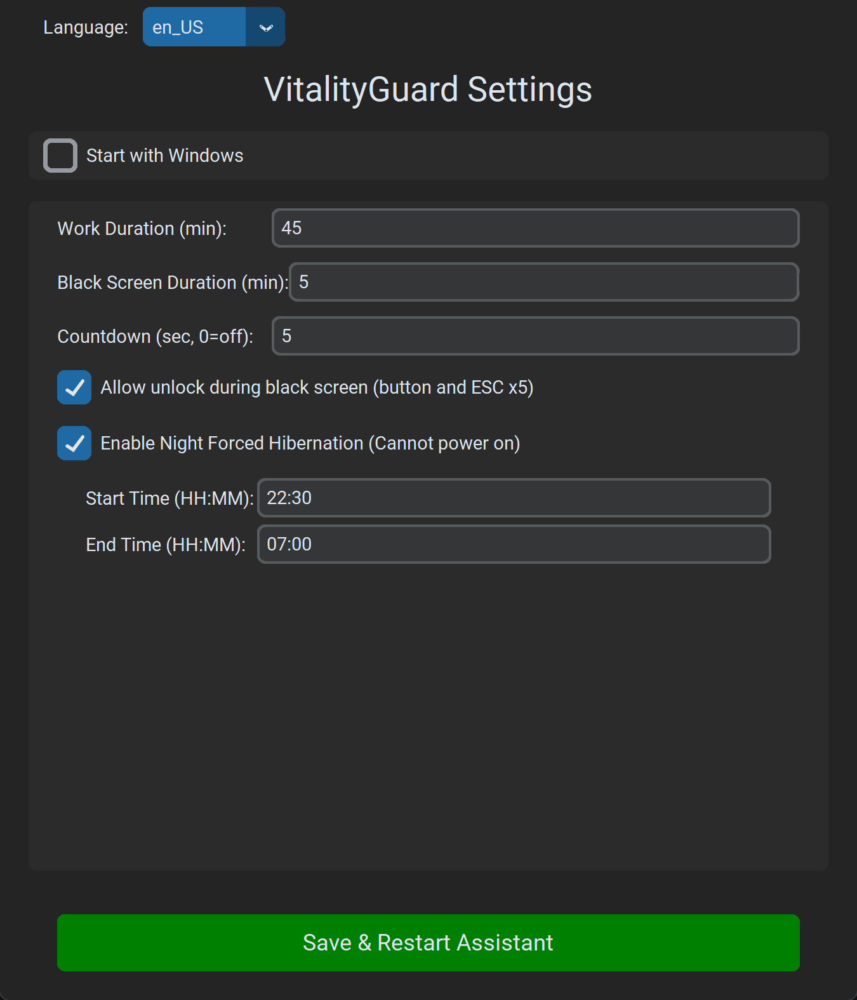
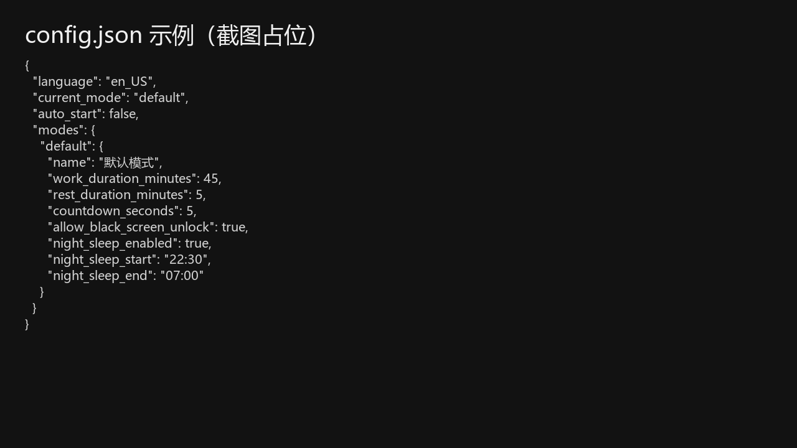

# VitalityGuard - Anti-Overwork Assistant

[中文](README_zh.md) | [日本語](README_ja.md) | [Français](README_fr.md) | [Deutsch](README_de.md) | [Español](README_es.md) | [한국어](README_ko.md) | [Русский](README_ru.md)

> **"Hearing recent news about sudden deaths from overwork has been heartbreaking. I spent a few days creating this tool, hoping it helps everyone stay healthy."**

**VitalityGuard** is a desktop health and control tool designed for Windows, aiming to help users manage work/rest cycles and enforce rest during specific times (e.g., night rest).

### Features

- **Work/Rest Cycles**: Customizable work/rest cycles (minutes).
- **Forced Black Screen/Hibernation**: 
  - Enforces a black screen during rest periods.
  - Option to force system hibernation for stricter control.
- **Night Rest Mode**:
  - Mandatory rest period (e.g., 22:30 - 07:00).
  - **Forced Hibernation**: System will be forced to hibernate if turned on during night rest.
- **Modern GUI**: Built with `customtkinter`.
- **Internationalization**: Supports 8 languages (English/Chinese/Japanese/French/German/Spanish/Korean/Russian).
- **Safety Features**:
  - **Optional Unlock During Black Screen**: Button click + press `ESC` 5 times (configurable).

### Installation

1. Ensure Python 3.8+ is installed.
2. Install dependencies:
   ```bash
   pip install -r requirements.txt
   ```

### Usage

1. Run the application:
   ```bash
   python main.py
   ```
2. Configure settings in the GUI.
3. Click "Save & Restart Assistant". The app will minimize to the system tray.
4. Right-click the tray icon to open settings or quit.

---

## Illustrated Tutorial (Windows)

This section is for running the EXE directly, and also applies to `python main.py`.

Screenshots are in [docs/images](docs/images/) (e.g. English: `docs/images/en_US/`).

### 1) First launch

1. Run `VitalityGuard.exe`.
2. The settings window opens (if not, check the system tray).


### 2) Adjust durations (recommended defaults)

Adjust:

- Work duration (minutes)
- Black screen duration (minutes)
- Countdown (seconds, 0 = off)

Recommended defaults:

- Work 60 min
- Black screen 5 min
- Countdown 10 sec



### 3) Unlock during black screen (enabled by default)

Setting: `Allow unlock during black screen (button and ESC x5)`

When enabled, you can unlock by:

- Clicking the “Emergency Unlock” button
- Pressing `ESC` 5 times



### 4) Save and run in tray

After clicking “Save & Restart Assistant”:

- The window hides (runs in background)
- A tray icon appears




### 5) Night rest (optional)

When enabled, the system can be forced into hibernation during the configured night window.



### 6) Config file

Config file: `%APPDATA%\\VitalityGuard\\config.json`



---

## FAQ

### EXE exits immediately / no window

Run `VitalityGuardDebug.exe` to see console errors, or check:

- `%APPDATA%\\VitalityGuard\\logs\\vitalityguard.log`

### Cannot find tray icon

Windows may hide it under the `^` (hidden tray icons).

### Feedback

Suggestions and Pull Requests are welcome!
If you find any bugs or have ideas for new features, please open an issue.

### Contact

Add me on WeChat:


