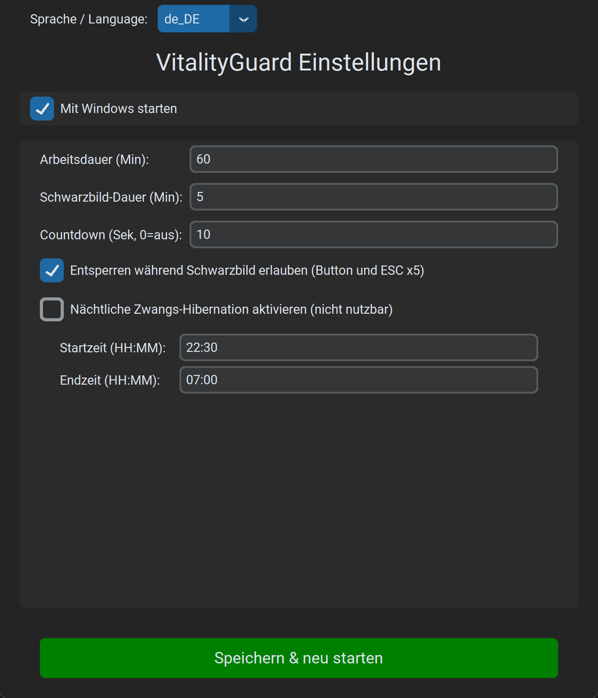
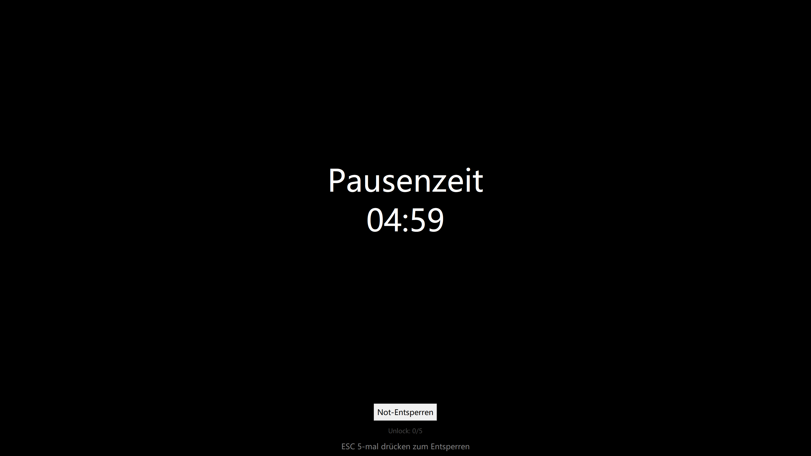
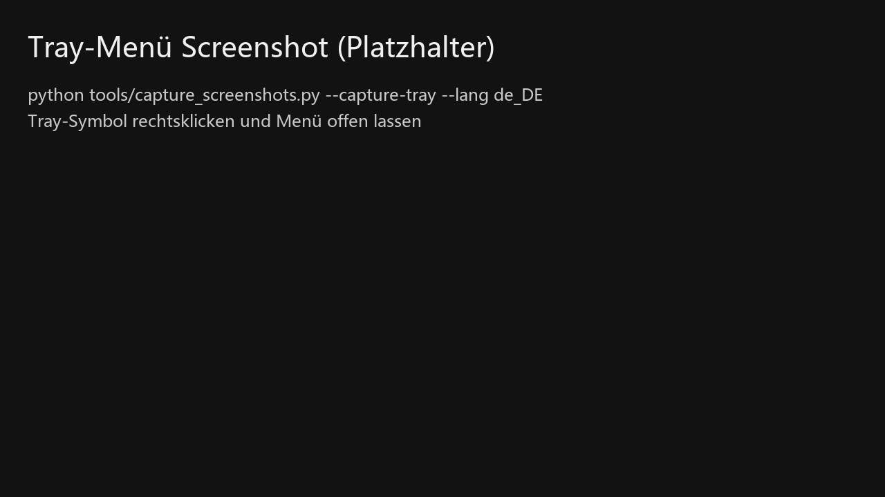
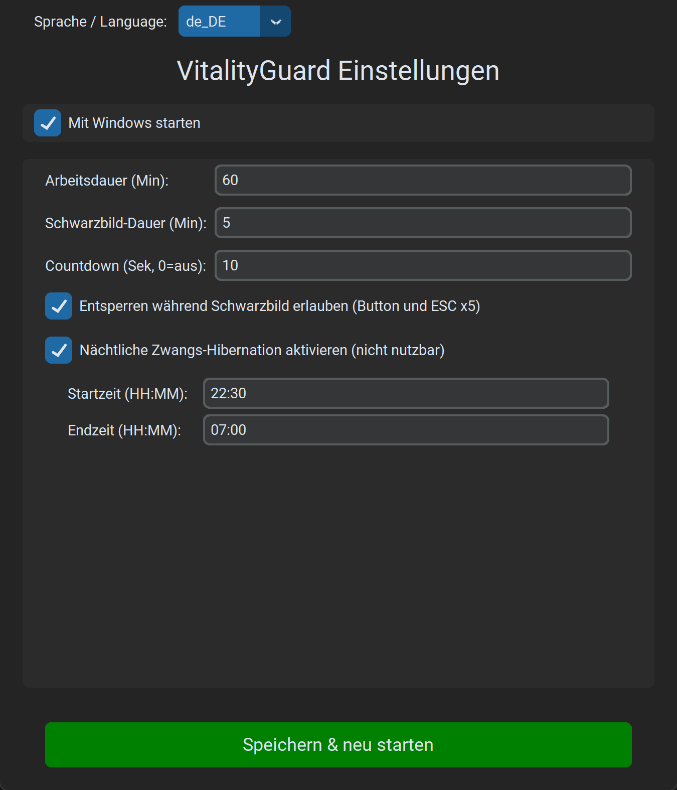

# VitalityGuard - Überlastungs-Assistent

[English](README.md) | [中文](README_zh.md) | [日本語](README_ja.md) | [Français](README_fr.md) | [Español](README_es.md) | [한국어](README_ko.md) | [Русский](README_ru.md)

> **„Berichte über plötzliche Todesfälle durch Überarbeitung sind erschütternd. Ich habe ein paar Tage investiert, um dieses Tool zu bauen – in der Hoffnung, dass es hilft.“**

**VitalityGuard** ist ein Windows-Desktop-Tool zur Gesundheits- und Nutzungssteuerung. Es verwaltet Arbeits-/Pausenzyklen und kann Ruhezeiten (z. B. nachts) erzwingen.

### Funktionen

- **Arbeits-/Pausenzyklen**: Arbeitszeit und Schwarzer-Bildschirm-Zeit (Minuten) einstellbar.
- **Erzwungener schwarzer Bildschirm / Ruhezustand**:
  - Zeigt während der Pause einen schwarzen Bildschirm.
  - Optional: Ruhezustand (Hibernate) für strengere Kontrolle.
- **Nachtruhe**:
  - Pflicht-Ruhefenster (z. B. 22:30 - 07:00).
  - **Erzwungener Ruhezustand**: Wenn aktiviert, wird der PC im Nachtruhefenster sofort in den Ruhezustand versetzt.
- **Moderne GUI**: mit `customtkinter`.
- **Internationalisierung**: 8 Sprachen (EN/ZH/JA/FR/DE/ES/KO/RU).
- **Sicherheit**:
  - **Optionales Entsperren beim schwarzen Bildschirm**: Button + `ESC` 5x (konfigurierbar).

### Installation

1. Python 3.8+ installieren.
2. Abhängigkeiten installieren:
   ```bash
   pip install -r requirements.txt
   ```

### Nutzung

1. Start:
   ```bash
   python main.py
   ```
2. Einstellungen anpassen.
3. „Save & Restart Assistant“ klicken. Die App läuft im Hintergrund (Tray).
4. Tray-Icon rechtsklicken: Einstellungen öffnen oder beenden.

---

## Illustrierte Anleitung (Windows)

Gilt für EXE und `python main.py`.

Screenshots: [docs/images](docs/images/) (Deutsch: `docs/images/de_DE/`).

### 1) Erster Start

1. `VitalityGuard.exe` starten.
2. Einstellungsfenster öffnet sich (sonst Tray prüfen).


### 2) Zeiten einstellen (empfohlene Standardwerte)

- Arbeitsdauer (Minuten)
- Schwarzer Bildschirm (Minuten)
- Countdown (Sekunden, 0 = aus)

Empfohlen:

- Arbeit 60 min
- Schwarzer Bildschirm 5 min
- Countdown 10 s



### 3) Entsperren während schwarzem Bildschirm (Standard: an)

Option: Entsperren erlauben (Button und `ESC` 5x).



### 4) Speichern und im Tray ausführen

Nach dem Speichern erscheint das Tray-Icon.




### 5) Nachtruhe (optional)



### 6) Konfigurationsdatei

Pfad: `%APPDATA%\\VitalityGuard\\config.json`


---

## FAQ

### EXE schließt sofort / kein Fenster

`VitalityGuardDebug.exe` starten oder Log prüfen:

- `%APPDATA%\\VitalityGuard\\logs\\vitalityguard.log`

### Tray-Icon nicht sichtbar

Windows kann es unter `^` (ausgeblendete Symbole) verstecken.

### Kontakt

WeChat hinzufügen:


