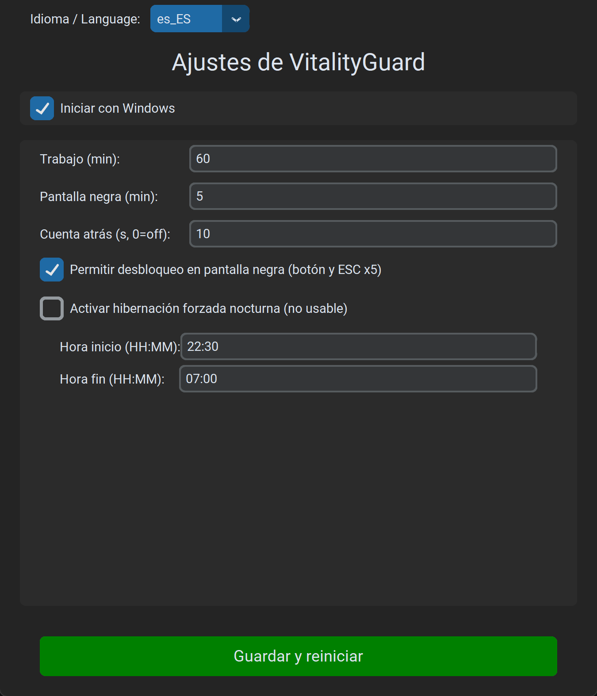
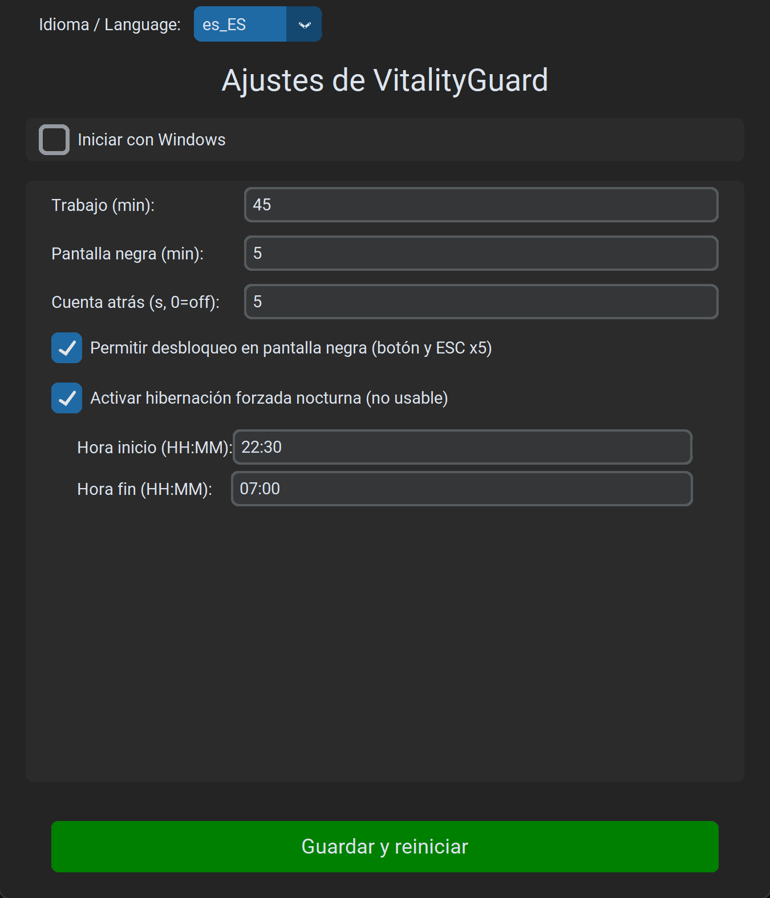
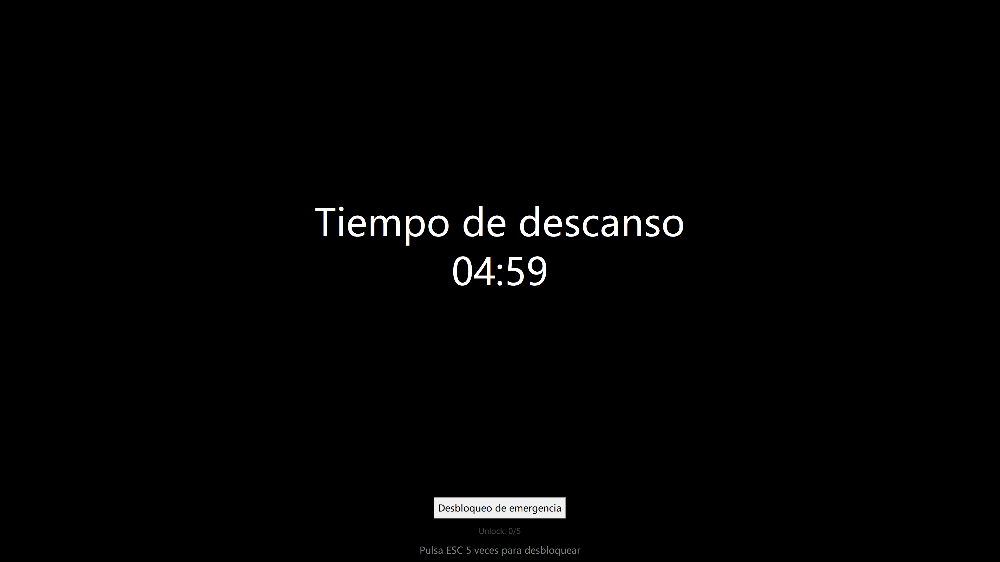
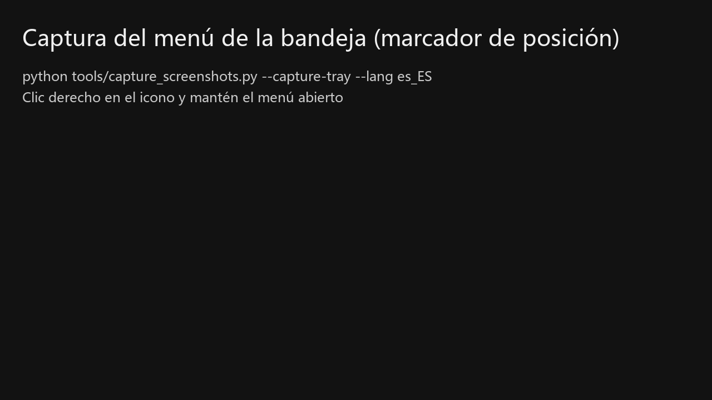
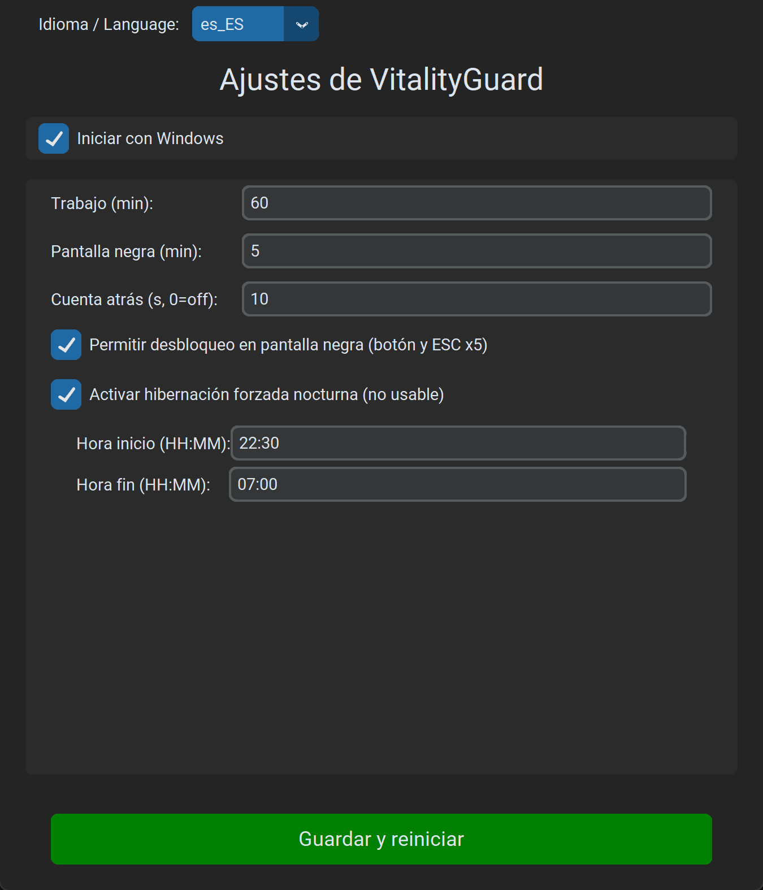
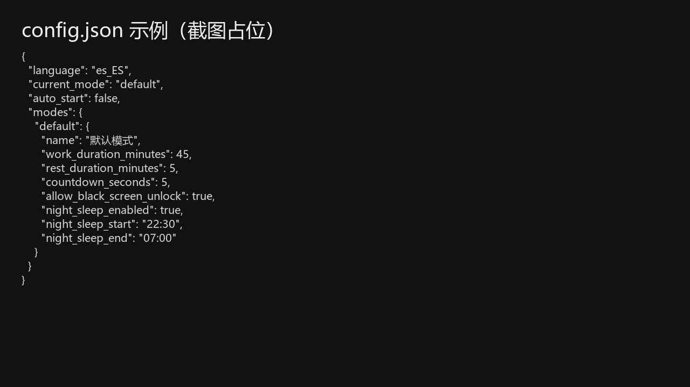

# VitalityGuard - Asistente Anti-Sobrecarga

[English](README.md) | [中文](README_zh.md) | [日本語](README_ja.md) | [Français](README_fr.md) | [Deutsch](README_de.md) | [한국어](README_ko.md) | [Русский](README_ru.md)

> **« Las noticias de muertes súbitas por exceso de trabajo son desgarradoras. Pasé unos días creando esta herramienta con la esperanza de que ayude. »**

**VitalityGuard** es una herramienta de salud/control para Windows. Gestiona ciclos de trabajo/descanso y puede imponer descanso en horarios específicos (por ejemplo, descanso nocturno).

### Funciones

- **Ciclos trabajo/descanso**: configura duración de trabajo y pantalla negra (minutos).
- **Pantalla negra forzada / hibernación**:
  - Pantalla negra durante el descanso.
  - Opción de hibernación para un control más estricto.
- **Descanso nocturno**:
  - Ventana de descanso obligatoria (p. ej. 22:30 - 07:00).
  - **Hibernación forzada**: si se activa durante la ventana nocturna, el sistema hiberna inmediatamente.
- **Interfaz moderna**: `customtkinter`.
- **Internacionalización**: 8 idiomas (EN/ZH/JA/FR/DE/ES/KO/RU).
- **Seguridad**:
  - **Desbloqueo opcional en pantalla negra**: botón + `ESC` x5 (configurable).

### Instalación

1. Asegúrate de tener Python 3.8+.
2. Instala dependencias:
   ```bash
   pip install -r requirements.txt
   ```

### Uso

1. Ejecuta:
   ```bash
   python main.py
   ```
2. Ajusta la configuración.
3. Pulsa “Save & Restart Assistant”. La app se ocultará y quedará en la bandeja del sistema.
4. Clic derecho en el icono para abrir ajustes o salir.

---

## Tutorial ilustrado (Windows)

Aplica para EXE y para `python main.py`.

Capturas: [docs/images](docs/images/) (Español: `docs/images/es_ES/`).

### 1) Primer inicio

1. Ejecuta `VitalityGuard.exe`.
2. Se abre la ventana de ajustes (si no, revisa la bandeja).



### 2) Ajustar duraciones (valores recomendados)

- Duración de trabajo (min)
- Duración de pantalla negra (min)
- Cuenta atrás (segundos, 0 = desactivado)

Recomendado:

- Trabajo 60 min
- Pantalla negra 5 min
- Cuenta atrás 10 s



### 3) Desbloquear durante pantalla negra (activado por defecto)

Opción: permitir desbloqueo (botón y `ESC` x5).



### 4) Guardar y ejecutar en la bandeja

Tras guardar, aparece el icono.




### 5) Descanso nocturno (opcional)



### 6) Archivo de configuración

Ruta: `%APPDATA%\\VitalityGuard\\config.json`



---

## FAQ

### El EXE se cierra inmediatamente / no aparece ventana

Ejecuta `VitalityGuardDebug.exe` o revisa el log:

- `%APPDATA%\\VitalityGuard\\logs\\vitalityguard.log`

### No encuentro el icono

Windows puede ocultarlo bajo `^` (iconos ocultos).

### Contacto

Añádeme en WeChat:


