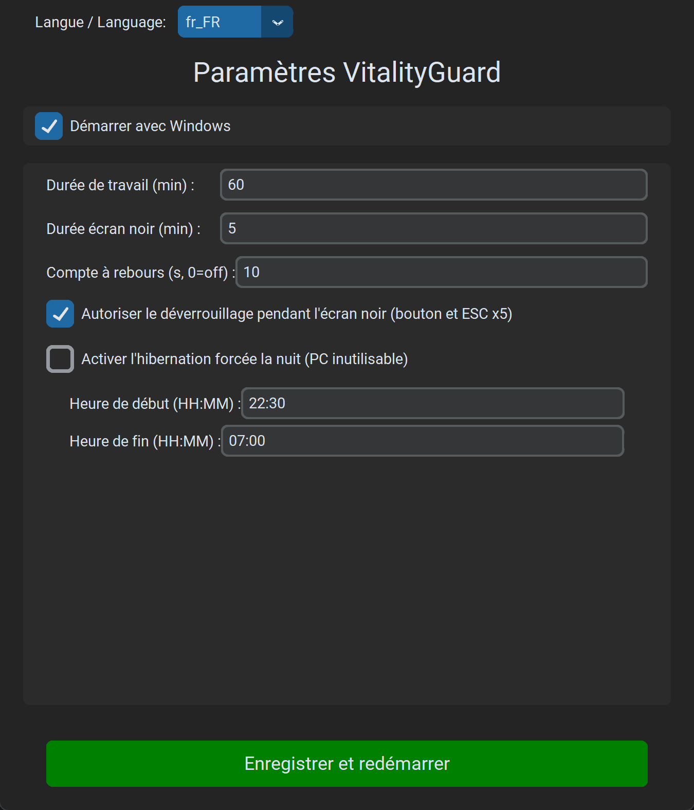
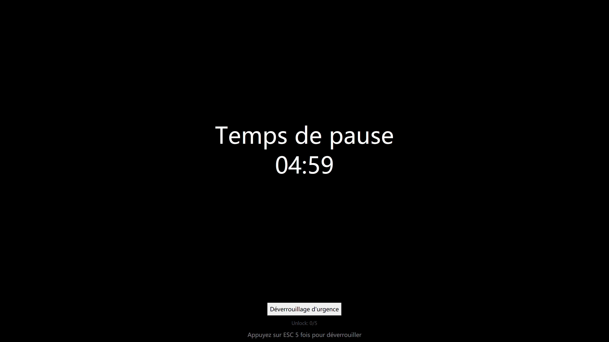
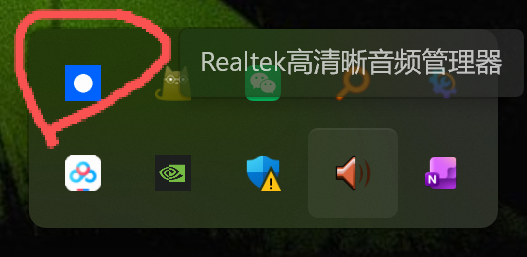
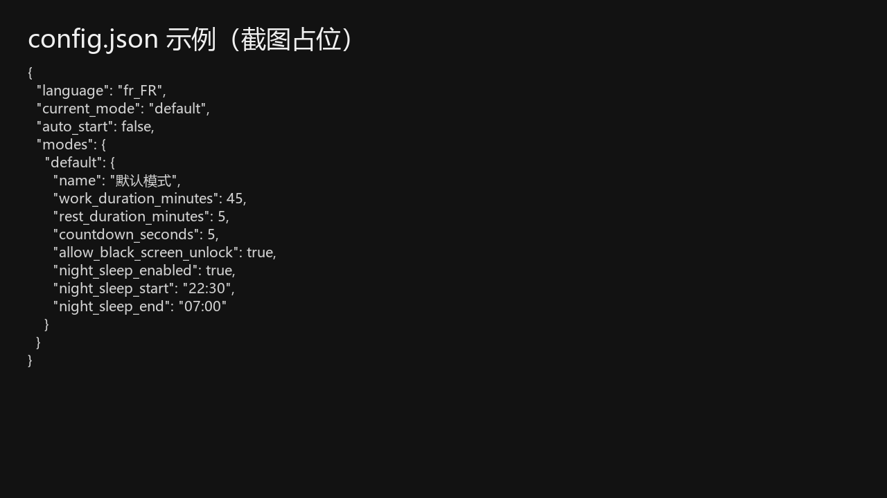

# VitalityGuard - Assistant Anti-Surcharge

[English](README.md) | [中文](README_zh.md) | [日本語](README_ja.md) | [Deutsch](README_de.md) | [Español](README_es.md) | [한국어](README_ko.md) | [Русский](README_ru.md)

> **« Les décès soudains liés au surmenage sont bouleversants. J’ai passé quelques jours à créer cet outil, en espérant qu’il puisse aider. »**

**VitalityGuard** est un outil anti-surmenage simple mais puissant conçu pour Windows.

**Simple et Efficace** : Pas de configuration complexe. Juste **une seule page de configuration** pour gérer votre santé.

Il vous aide à imposer des cycles de travail/repos et un repos nocturne obligatoire pour prévenir les risques pour la santé liés à une utilisation prolongée de l'ordinateur.

github_url : https://github.com/1484416276/VitalityGuard/

## Tutoriel illustré (Windows)

### 1) Premier lancement et configuration

1. Lancez `VitalityGuard.exe`. La fenêtre s’ouvre (sinon, vérifiez la zone de notification).
2. **Régler les durées** (recommandé) :
   - Travail 60 min / Écran noir 5 min / Compte à rebours 10 s
3. **Repos nocturne** (optionnel) :
   - Activez l'hibernation forcée la nuit (par défaut 22:30 - 07:00). Testez d'abord en journée !



### 2) Déverrouillage pendant l’écran noir (activé par défaut)

Option : autoriser le déverrouillage (bouton et `ESC` x5).



### 3) Enregistrer et exécuter en arrière-plan

Après l’enregistrement, l’icône apparaît dans la zone de notification.



### Fonctionnalités

- **Cycles travail/repos** : réglage de la durée de travail et de l’écran noir (en minutes).
- **Écran noir forcé / mise en veille prolongée** :
  - Affiche un écran noir pendant la pause.
  - Option de mise en veille prolongée pour un contrôle plus strict.
- **Repos nocturne** :
  - Période de repos obligatoire (ex. 22:30 - 07:00).
  - **Mise en veille prolongée forcée** : si activé pendant la période, l’ordinateur est immédiatement mis en veille prolongée.
- **Interface moderne** : basée sur `customtkinter`.
- **Internationalisation** : 8 langues (EN/ZH/JA/FR/DE/ES/KO/RU).
- **Sécurité** :
  - **Déverrouillage optionnel pendant l’écran noir** : bouton + `ESC` x5 (configurable).

### Installation

Téléchargement de l’EXE Windows :

- https://github.com/1484416276/VitalityGuard/releases/latest

1. Vérifiez que Python 3.8+ est installé.
2. Installez les dépendances :
   ```bash
   pip install -r requirements.txt
   ```

### Utilisation

1. Lancez l’application :
   ```bash
   python main.py
   ```
2. Modifiez les paramètres dans la fenêtre.
3. Cliquez sur « Save & Restart Assistant ». L’appli se cache et reste dans la zone de notification.
4. Clic droit sur l’icône pour rouvrir les paramètres ou quitter.

Chemin : `%APPDATA%\\VitalityGuard\\config.json`



---

## FAQ

### L’EXE se ferme immédiatement / aucune fenêtre

VitalityGuard.exe enregistre des logs pour le diagnostic. Vérifiez :

- `%APPDATA%\\VitalityGuard\\logs\\vitalityguard.log`

### Icône introuvable

Windows peut la placer sous `^` (icônes masquées).

### Contact

Ajoutez-moi sur WeChat :


