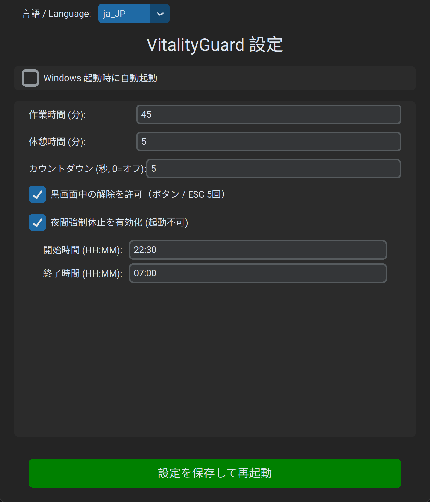
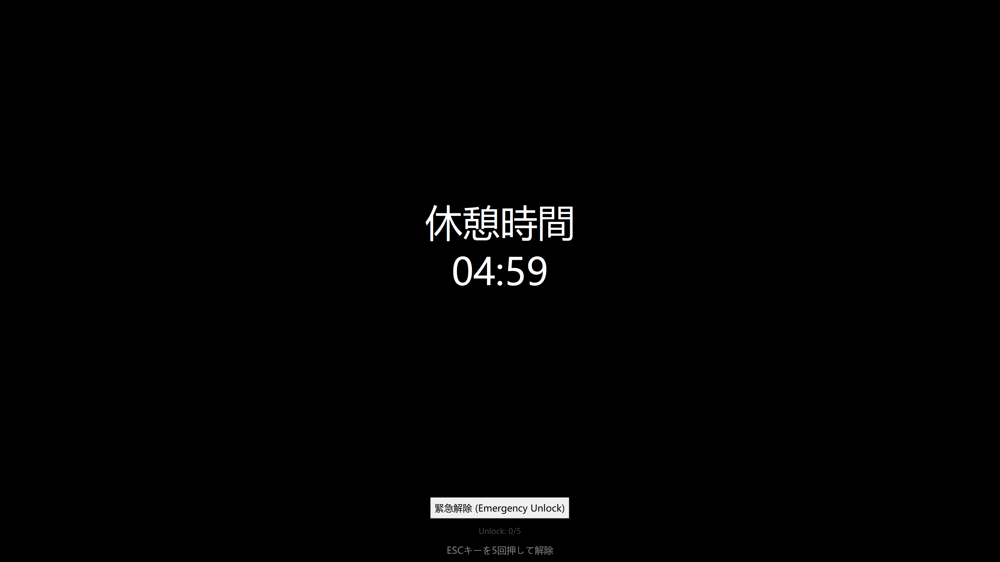
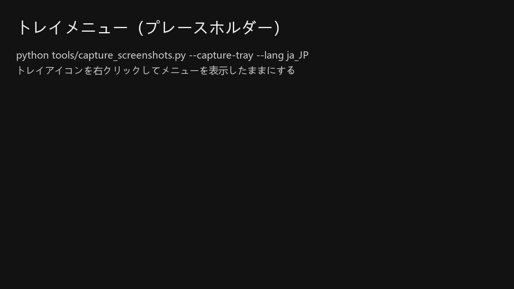
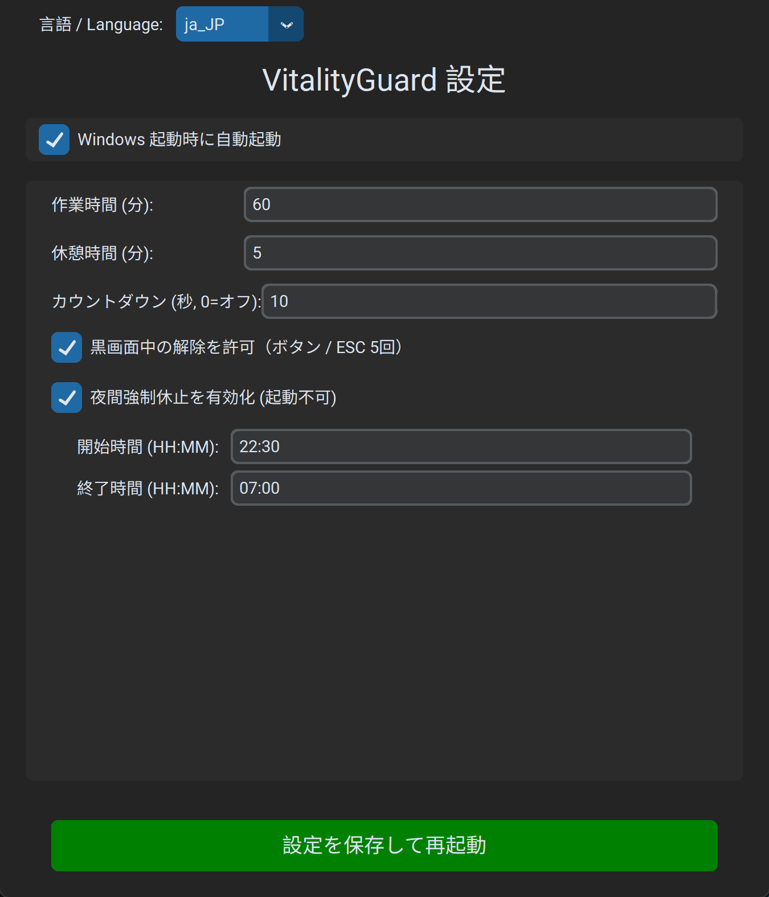
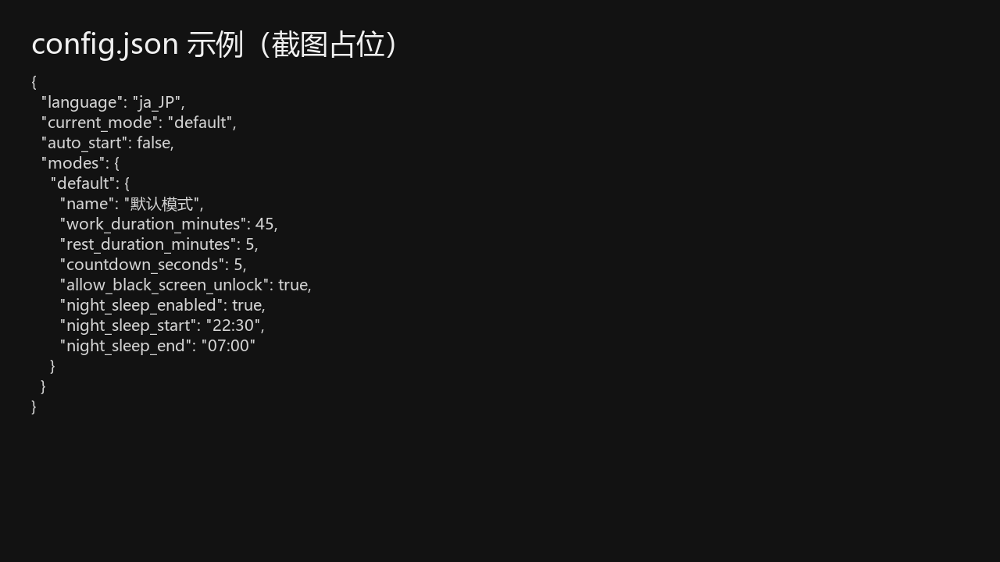

# VitalityGuard - 過労防止アシスタント

[English](README.md) | [中文](README_zh.md) | [Français](README_fr.md) | [Deutsch](README_de.md) | [Español](README_es.md) | [한국어](README_ko.md) | [Русский](README_ru.md)

> **「過労による突然死のニュースに心を痛め、数日かけてこのツールを作成しました。皆様の健康維持に役立つことを願っています。」**

**VitalityGuard (過労防止アシスタント)** は、Windows向けに設計された健康管理ツールです。仕事と休憩のサイクルを管理し、特定の時間（夜間など）に強制的に休憩を取らせることを目的としています。

### 機能

- **仕事/休憩サイクル**: 作業/ブラックスクリーン時間（分）を設定可能。
- **強制ブラックスクリーン/休止**: 
  - 休憩中は全画面がブラックアウトします。
  - より厳格な制御のためにシステム休止を強制するオプションもあります。
- **夜間休憩モード**:
  - 強制的な休憩時間帯（例：22:30 - 07:00）。
  - **強制休止**: この時間帯にPCを起動しても、即座に強制休止されます。
- **モダンなGUI**: `customtkinter` を使用。
- **多言語対応**: 8言語対応（英語/中国語/日本語/フランス語/ドイツ語/スペイン語/韓国語/ロシア語）。
- **安全機能**:
  - **ブラックスクリーン中の解除（任意）**: ボタン押下または `ESC` 5回連打で解除（設定可能）。

### インストール

1. Python 3.8以上がインストールされていることを確認してください。
2. 依存関係をインストールします：
   ```bash
   pip install -r requirements.txt
   ```

### 使用方法

1. プログラムを実行します：
   ```bash
   python main.py
   ```
2. 設定画面でパラメータを調整します。
3. 「設定を保存して再起動」をクリックします。アプリは最小化され、システムトレイでバックグラウンド実行されます。
4. トレイアイコンを右クリックして、設定を開くか終了します。

---

## 図解チュートリアル（Windows）

この章は EXE での実行を想定していますが、`python main.py` でも同様です。

スクリーンショットは [docs/images](docs/images/) 配下に置きます。日本語は `docs/images/ja_JP/` を使用します。

### 1) 初回起動

1. `VitalityGuard.exe` を実行します。
2. 設定ウィンドウが開きます（開かない場合はトレイを確認）。



### 2) 時間設定（推奨デフォルト）

以下を調整します：

- 作業時間（分）
- ブラックスクリーン時間（分）
- カウントダウン（秒、0でオフ）

推奨デフォルト：

- 作業 45分
- ブラックスクリーン 5分
- カウントダウン 5秒


### 3) ブラックスクリーン中の解除（デフォルトON）

設定：黒画面中の解除を許可（ボタン / ESC 5回）

解除方法：

- 「緊急解除」ボタン
- `ESC` を5回連打



### 4) 保存してトレイ常駐

保存後、アプリは非表示になりトレイで動作します。




### 5) 夜間休憩（任意）

夜間時間帯に強制休止を行います。先に昼間で動作確認をおすすめします。



### 6) 設定ファイル

設定ファイル：`%APPDATA%\\VitalityGuard\\config.json`



---

## よくある質問

### EXE がすぐ終了する / 画面が出ない

`VitalityGuardDebug.exe` でコンソールエラーを確認するか、ログを確認してください：

- `%APPDATA%\\VitalityGuard\\logs\\vitalityguard.log`

### トレイにアイコンが見つからない

Windows の `^`（隠しアイコン）に入っている場合があります。

### フィードバック

ご意見やバグ報告は大歓迎です！
IssueやPull Requestをお待ちしております。VitalityGuardをより良くするためにご協力ください。

### 連絡先

WeChatで追加：


