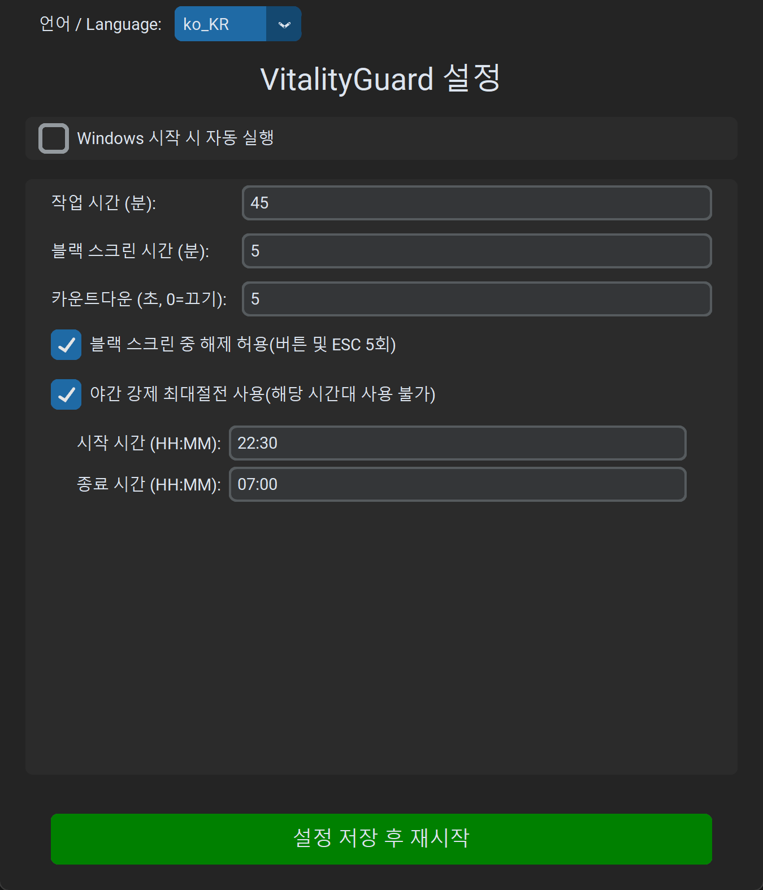
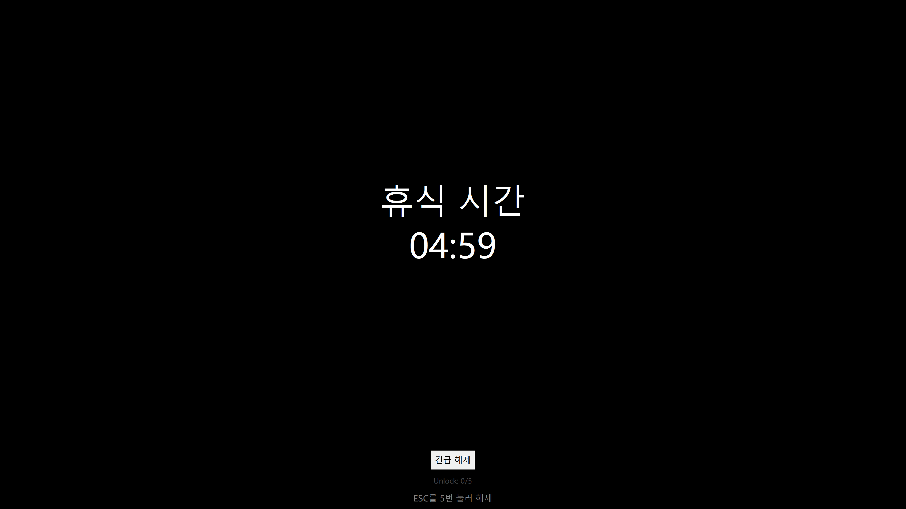
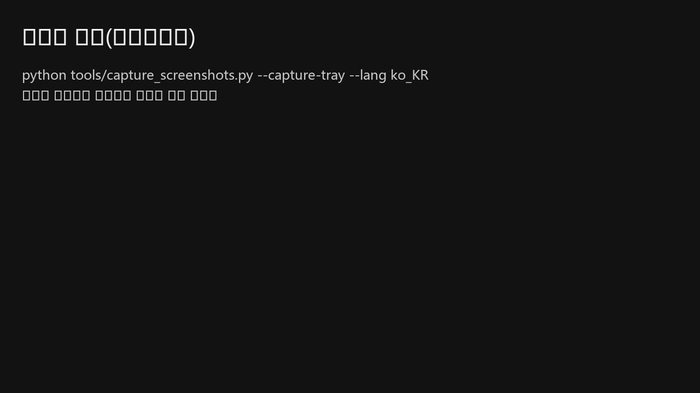
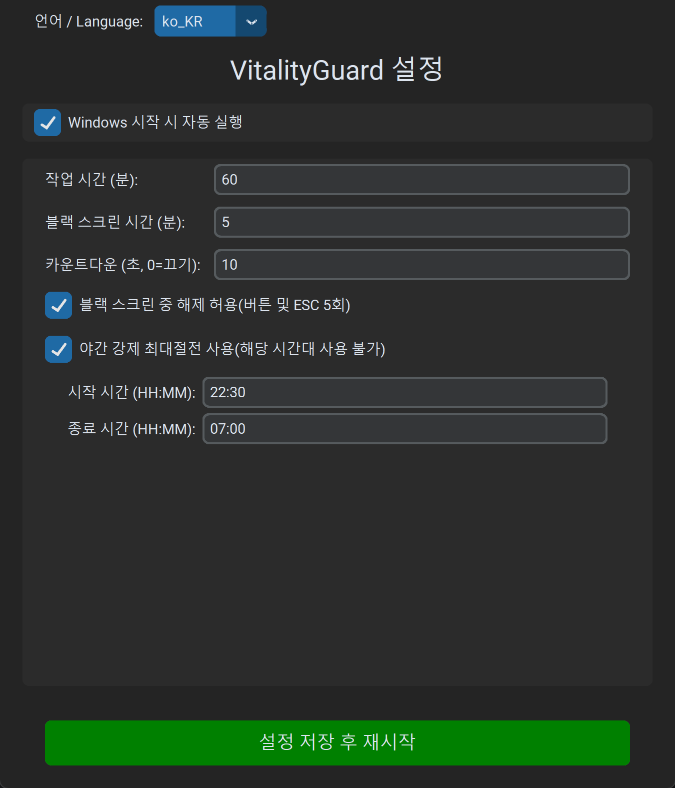
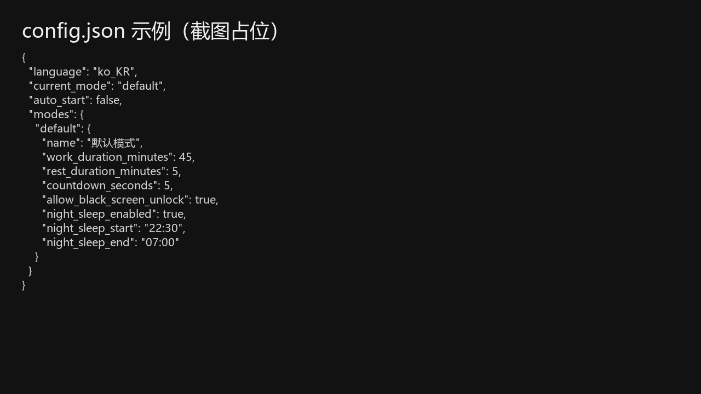

# VitalityGuard - 과로 방지 도우미

[English](README.md) | [中文](README_zh.md) | [日本語](README_ja.md) | [Français](README_fr.md) | [Deutsch](README_de.md) | [Español](README_es.md) | [Русский](README_ru.md)

> **“과로로 인한 갑작스러운 사망 소식은 마음이 아픕니다. 며칠 동안 이 도구를 만들었고, 도움이 되길 바랍니다.”**

**VitalityGuard**는 Windows용 데스크톱 건강/사용 제어 도구입니다. 작업/휴식 사이클을 관리하고, 특정 시간(예: 야간 휴식)에 강제로 휴식을 적용할 수 있습니다.

### 기능

- **작업/휴식 사이클**: 작업 시간과 검은 화면 시간(분) 설정.
- **강제 검은 화면 / 최대 절전 모드**:
  - 휴식 기간 동안 검은 화면을 표시합니다.
  - 더 강한 제어를 위해 최대 절전 모드를 강제할 수 있습니다.
- **야간 휴식**:
  - 강제 휴식 시간대(예: 22:30 - 07:00).
  - **강제 최대 절전**: 야간 휴식 시간대에 켜면 즉시 최대 절전으로 전환됩니다.
- **모던 GUI**: `customtkinter` 기반.
- **다국어**: 8개 언어(EN/ZH/JA/FR/DE/ES/KO/RU).
- **안전 기능**:
  - **검은 화면 중 해제(선택)**: 버튼 + `ESC` 5회 (설정 가능).

### 설치

Windows EXE 다운로드:

- https://github.com/1484416276/VitalityGuard/releases/latest

1. Python 3.8+ 설치.
2. 의존성 설치:
   ```bash
   pip install -r requirements.txt
   ```

### 사용 방법

1. 실행:
   ```bash
   python main.py
   ```
2. 설정 창에서 값을 조정합니다.
3. “Save & Restart Assistant”를 누르면 창이 숨겨지고 트레이에서 실행됩니다.
4. 트레이 아이콘을 우클릭하여 설정을 열거나 종료합니다.

---

## 그림 튜토리얼 (Windows)

EXE 실행 및 `python main.py` 모두에 적용됩니다.

스크린샷: [docs/images](docs/images/) (한국어: `docs/images/ko_KR/`).

### 1) 첫 실행

1. `VitalityGuard.exe` 실행.
2. 설정 창이 열립니다(안 열리면 트레이를 확인).



### 2) 시간 설정(권장 기본값)

- 작업 시간(분)
- 검은 화면 시간(분)
- 카운트다운(초, 0 = 끔)

권장:

- 작업 60분
- 검은 화면 5분
- 카운트다운 10초


### 3) 검은 화면 중 해제(기본: 켬)

옵션: 해제 허용(버튼 + `ESC` 5회).



### 4) 저장 후 트레이에서 실행

저장 후 트레이 아이콘이 나타납니다.




### 5) 야간 휴식(선택)



### 6) 설정 파일

경로: `%APPDATA%\\VitalityGuard\\config.json`



---

## FAQ

### EXE가 바로 종료됨 / 창이 안 뜸

VitalityGuard.exe는 문제 진단을 위한 로그를 기록합니다. 아래 로그를 확인하세요:

- `%APPDATA%\\VitalityGuard\\logs\\vitalityguard.log`

### 트레이 아이콘이 안 보임

Windows에서 `^`(숨겨진 아이콘)에 있을 수 있습니다.

### 연락처

WeChat 추가:


