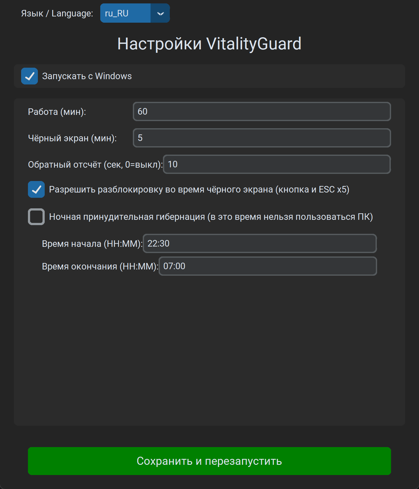
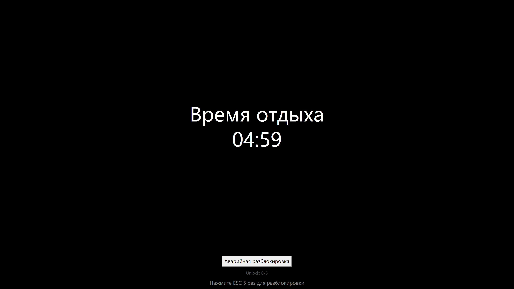
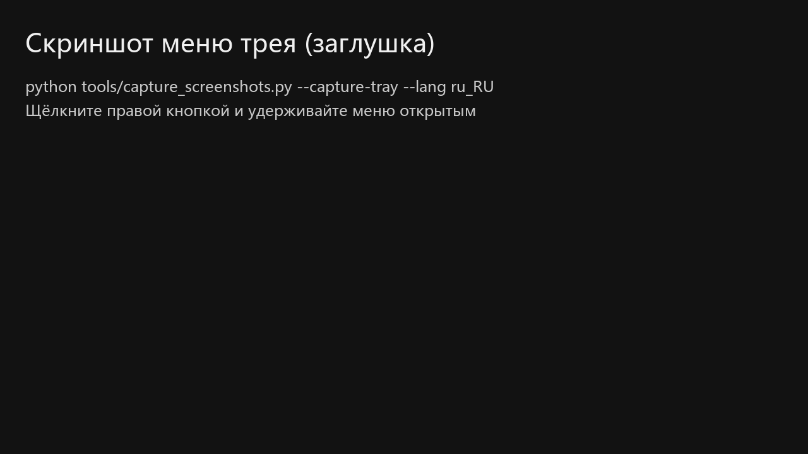
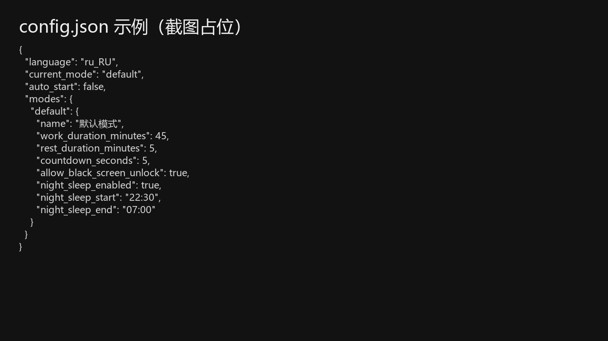

# VitalityGuard - Помощник против переработок

[English](README.md) | [中文](README_zh.md) | [日本語](README_ja.md) | [Français](README_fr.md) | [Deutsch](README_de.md) | [Español](README_es.md) | [한국어](README_ko.md)

> **« Новости о внезапных смертях из‑за переработок очень тяжёлые. Я потратил несколько дней на этот инструмент и надеюсь, что он поможет. »**

**VitalityGuard** — это простой, но мощный инструмент против переработок для Windows.

**Просто и эффективно**: Никаких сложных настроек. Всего **одна страница конфигурации** для заботы о здоровье.

Помогает соблюдать циклы работы/отдыха и обязательный ночной отдых, предотвращая риски для здоровья от долгого сидения за компьютером.

### Возможности

- **Циклы работа/отдых**: настраиваемые длительности работы и чёрного экрана (в минутах).
- **Принудительный чёрный экран / гибернация**:
  - В период отдыха показывает чёрный экран.
  - Опционально можно принудительно включать гибернацию для более строгого режима.
- **Ночной отдых**:
  - Обязательное окно отдыха (например, 22:30 - 07:00).
  - **Принудительная гибернация**: если включено, в ночное окно компьютер сразу уходит в гибернацию.
- **Современный интерфейс**: `customtkinter`.
- **Интернационализация**: 8 языков (EN/ZH/JA/FR/DE/ES/KO/RU).
- **Безопасность**:
  - **Опциональная разблокировка в чёрном экране**: кнопка + `ESC` 5 раз (настраивается).

### Установка

Скачать Windows EXE:

- https://github.com/1484416276/VitalityGuard/releases/latest

1. Убедитесь, что установлен Python 3.8+.
2. Установите зависимости:
   ```bash
   pip install -r requirements.txt
   ```

### Использование

1. Запуск:
   ```bash
   python main.py
   ```
2. Настройте параметры в окне.
3. Нажмите «Save & Restart Assistant». Окно скроется, приложение останется в трее.
4. ПКМ по значку в трее: открыть настройки или выйти.

---

## Иллюстрированное руководство (Windows)

Подходит для запуска EXE и `python main.py`.

Скриншоты: [docs/images](docs/images/) (Русский: `docs/images/ru_RU/`).

### 1) Первый запуск и настройка

1. Запустите `VitalityGuard.exe`. Откроется окно настроек (если нет — проверьте трей).
2. **Настройка длительностей** (Рекомендуется):
   - Работа 60 мин / Чёрный экран 5 мин / Отсчёт 10 сек
3. **Ночной отдых** (Опционально):
   - Если включено (по умолчанию 22:30 - 07:00), система принудительно перейдет в гибернацию. Проверьте днем!



### 2) Разблокировка во время чёрного экрана (включено по умолчанию)

Опция: разрешить разблокировку (кнопка и `ESC` 5 раз).



### 3) Сохранить и работать в трее

После сохранения появится значок в трее.




### 4) Файл конфигурации

Путь: `%APPDATA%\\VitalityGuard\\config.json`



---

## FAQ

### EXE сразу закрывается / нет окна

VitalityGuard.exe записывает лог для диагностики. Проверьте:

- `%APPDATA%\\VitalityGuard\\logs\\vitalityguard.log`

### Не вижу значок в трее

Windows может скрыть его под `^` (скрытые значки).

### Контакты

Добавьте меня в WeChat:


