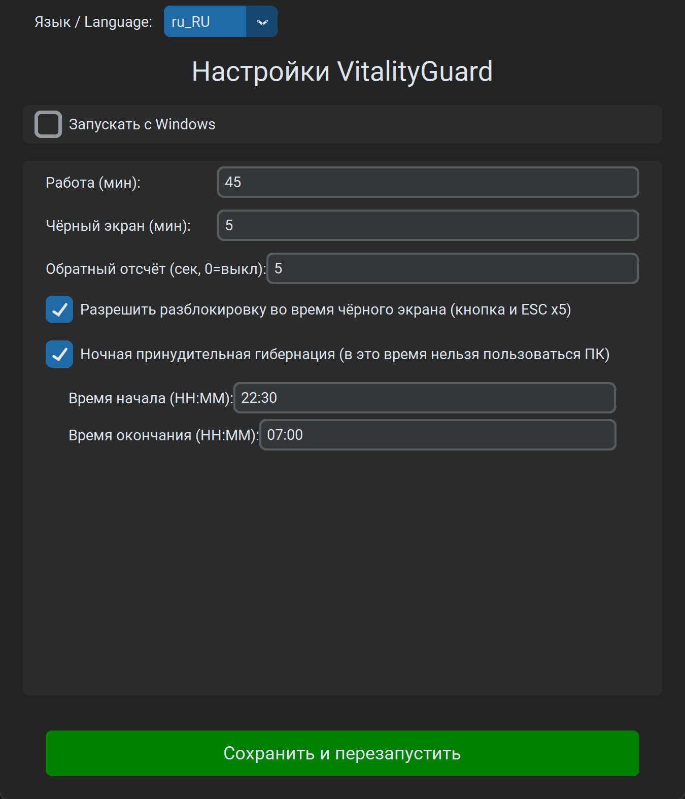

# VitalityGuard - Помощник против переработок

[English](README.md) | [中文](README_zh.md) | [日本語](README_ja.md) | [Français](README_fr.md) | [Deutsch](README_de.md) | [Español](README_es.md) | [한국어](README_ko.md)

> **« Новости о внезапных смертях из‑за переработок очень тяжёлые. Я потратил несколько дней на этот инструмент и надеюсь, что он поможет. »**

**VitalityGuard** — настольный инструмент для Windows, который помогает управлять циклами работа/отдых и принудительно включать отдых в заданные часы (например, ночью).

### Возможности

- **Циклы работа/отдых**: настраиваемые длительности работы и чёрного экрана (в минутах).
- **Принудительный чёрный экран / гибернация**:
  - В период отдыха показывает чёрный экран.
  - Опционально можно принудительно включать гибернацию для более строгого режима.
- **Ночной отдых**:
  - Обязательное окно отдыха (например, 22:30 - 07:00).
  - **Принудительная гибернация**: если включено, в ночное окно компьютер сразу уходит в гибернацию.
- **Современный интерфейс**: `customtkinter`.
- **Интернационализация**: 8 языков (EN/ZH/JA/FR/DE/ES/KO/RU).
- **Безопасность**:
  - **Опциональная разблокировка в чёрном экране**: кнопка + `ESC` 5 раз (настраивается).

### Установка

1. Убедитесь, что установлен Python 3.8+.
2. Установите зависимости:
   ```bash
   pip install -r requirements.txt
   ```

### Использование

1. Запуск:
   ```bash
   python main.py
   ```
2. Настройте параметры в окне.
3. Нажмите «Save & Restart Assistant». Окно скроется, приложение останется в трее.
4. ПКМ по значку в трее: открыть настройки или выйти.

---

## Иллюстрированное руководство (Windows)

Подходит для запуска EXE и `python main.py`.

Скриншоты: [docs/images](docs/images/) (Русский: `docs/images/ru_RU/`).

### 1) Первый запуск

1. Запустите `VitalityGuard.exe`.
2. Откроется окно настроек (если нет — проверьте трей).


### 2) Настройка длительностей (рекомендуемые значения)

- Длительность работы (минуты)
- Длительность чёрного экрана (минуты)
- Обратный отсчёт (секунды, 0 = выключено)

Рекомендуется:

- Работа 45 мин
- Чёрный экран 5 мин
- Отсчёт 5 сек



### 3) Разблокировка во время чёрного экрана (включено по умолчанию)

Опция: разрешить разблокировку (кнопка и `ESC` 5 раз).


### 4) Сохранить и работать в трее

После сохранения появится значок в трее.


### 5) Ночной отдых (опционально)


### 6) Файл конфигурации

Путь: `%APPDATA%\\VitalityGuard\\config.json`


---

## FAQ

### EXE сразу закрывается / нет окна

Запустите `VitalityGuardDebug.exe` или проверьте лог:

- `%APPDATA%\\VitalityGuard\\logs\\vitalityguard.log`

### Не вижу значок в трее

Windows может скрыть его под `^` (скрытые значки).

### Контакты

Добавьте меня в WeChat:


