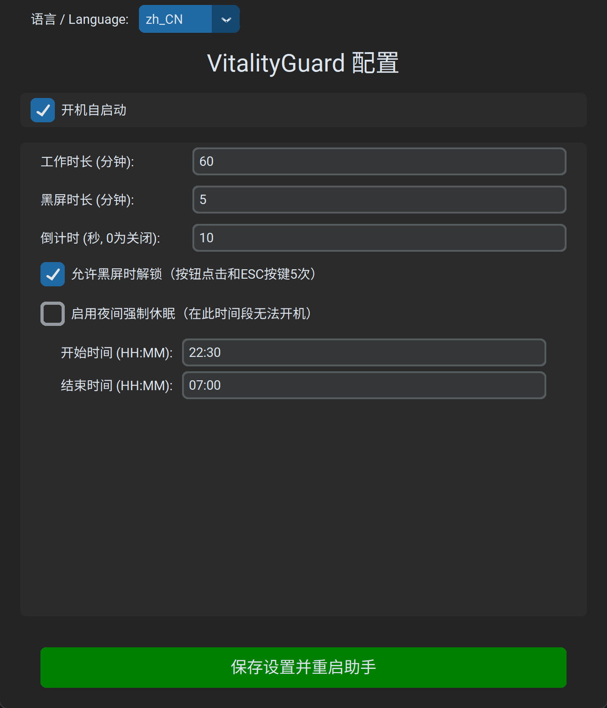
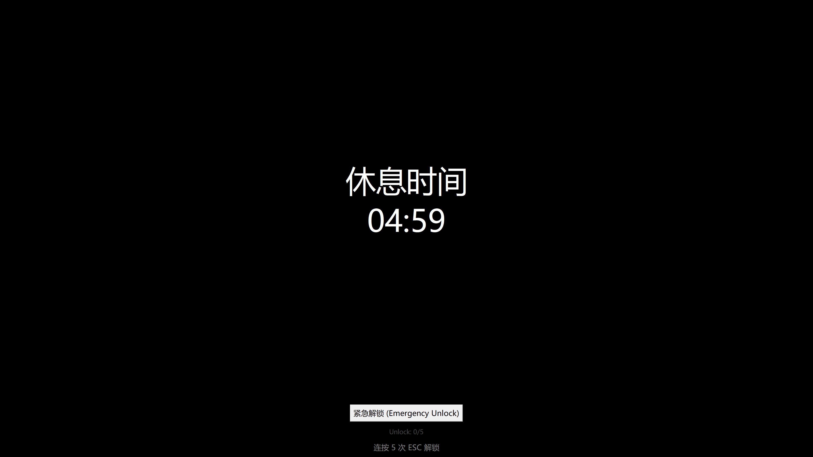
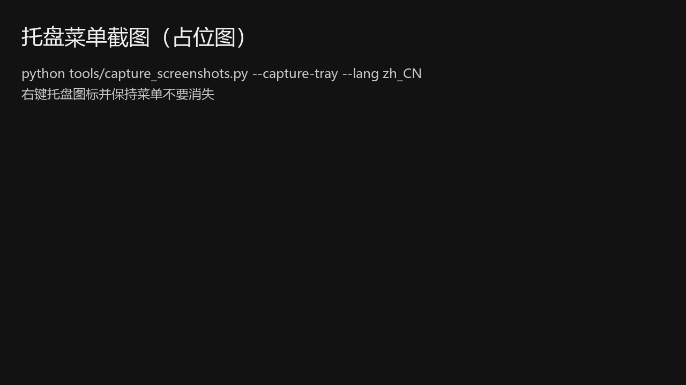
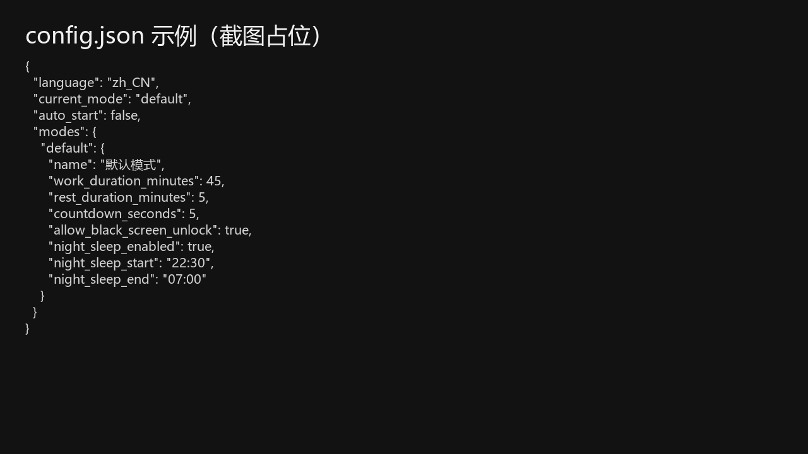

# VitalityGuard - 防猝死助手

[English](README.md) | [日本語](README_ja.md) | [Français](README_fr.md) | [Deutsch](README_de.md) | [Español](README_es.md) | [한국어](README_ko.md) | [Русский](README_ru.md)

> **“又听闻有人猝死的新闻，深感痛心。花了几天时间写了这个助手，希望能帮到大家。”**

**VitalityGuard (防猝死助手)** 是一个专为 Windows 设计的桌面健康与控制工具，旨在帮助用户管理工作与休息时间，并在特定时间（如夜间休息）强制休息。

### 最近更新

- 修复 PyInstaller 打包后 Tcl/Tk 版本冲突问题
- 增强 EXE 日志落盘与异常排查能力
- 新增自检参数（--self-test）以覆盖正反例
- 本地测试/工具归档至 .local，避免推送到 GitHub
- README 增加 EXE 下载入口

### 功能特性

- **工作/休息循环**：自定义工作/黑屏时长（分钟）。
- **强制黑屏/休眠**：
  - 休息期间强制全屏黑屏。
  - 可配置强制系统休眠。
- **夜间休息模式**：
  - 强制休息时段（默认 22:30 - 07:00）。
  - **强制休眠**：在此时间段内开机将被立即强制休眠，无法使用电脑。
- **现代化界面**：使用 `customtkinter` 构建。
- **多语言支持**：支持 8 种语言（中文/英语/日语/法语/德语/西班牙语/韩语/俄语）。
- **安全功能**：
  - **可选黑屏解锁**：黑屏时可通过“紧急解锁”按钮或连按 `ESC` 5 次解锁（可配置）。

### 安装

Windows EXE 下载地址：

- https://github.com/1484416276/VitalityGuard/releases/latest

1. 确保已安装 Python 3.8+。
2. 安装依赖：
   ```bash
   pip install -r requirements.txt
   ```

### 使用方法

1. 运行程序：
   ```bash
   python main.py
   ```
2. 在弹出的设置界面中调整参数。
3. 点击“保存设置并重启助手”。程序将隐藏并在后台运行。
4. 右键点击系统托盘图标可重新打开设置或退出。

---

## 图文教程（Windows）

本节适用于“直接用 EXE 运行”，也适用于 `python main.py` 运行。

截图文件放在 [docs/images](docs/images/)；中文截图默认放在 `docs/images/zh_CN/`。

### 1) 首次运行与参数设置

1. 运行 `VitalityGuard.exe`，弹出设置窗口（若未弹出请检查托盘图标）。
2. **设置时长**（推荐默认值）：
   - 工作 60 分钟 / 黑屏 5 分钟 / 倒计时 10 秒
3. **夜间休息**（可选）：
   - 开启后，在指定时间段内（默认 22:30 - 07:00）会强制休眠，建议先在白天测试确认符合习惯再启用。



### 2) 黑屏解锁（默认开启）

配置项：`允许黑屏时解锁（按钮点击和ESC按键5次）`

开启后，黑屏期间两种解锁方式都可用：

- 点击“紧急解锁”按钮
- 连按 `ESC` 5 次



### 3) 保存并在托盘后台运行

点击“保存设置并重启助手”后，程序会隐藏并在托盘显示图标。




### 4) 配置文件

配置文件路径：`%APPDATA%\\VitalityGuard\\config.json`



---

## 常见问题

### 双击 EXE 没反应 / 一闪而过

VitalityGuard.exe 会记录日志用于排查问题，请查看：

- `%APPDATA%\\VitalityGuard\\logs\\vitalityguard.log`

### 托盘里找不到图标

Windows 可能把图标折叠到 `^`（隐藏图标）里。

### 反馈与建议

如果您有任何建议或发现 Bug，欢迎提交 Issue 或 Pull Request！
您的反馈将帮助我们把 VitalityGuard 做得更好。

### 联系作者
微信扫码添加：


